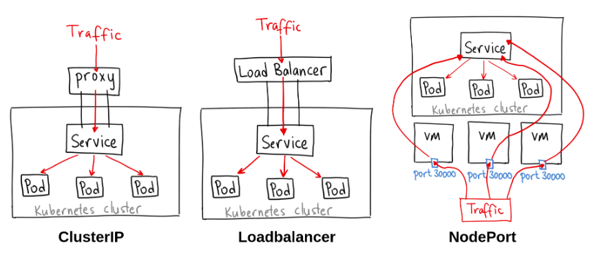

# Service

서비스(Service)는 파드들의 네트워크 접근을 관리하는 Kubernetes 리소스 
- 고정된 IP주소와 DNS 이름 제공 (Pod는 생성될떄마다 새로운 ip주소 할당, 재시작 되거나 삭제될 경우 ip주소가 변경됨, 서비스는 일관된 네트워크 접근을 가능하도록 고정시켜주는것) 
    - -> 클러스터 내부에서 서비스 간에 네트워크 통신을 안정적으로 유지

- Pod의 IP는 휘발성이기 때문에, 영구적인 Service의 IP를 통해서 연결
- ClusterIP 타입은 Cluster 내에서만 접근 가능
- Service는 여러 Pod에 연결이 가능하며, 각 Pod에 Random으로 트래픽은 보내줌

서비스의 종류에 따라 파드에 접근을 도와주는 방식이 다름

| 서비스 종류       | 접속 가능 위치   |        |
| ------------ | ---------------- | --- |
| ClusterIP    | 내부 전용    | -  외부에서는 접속 불가 <br> -  클러스터 내부의 파드끼리만 통신 가능 <br> -  기본값(Default) 설정      |
| NodePort     | 내부망연결/외부 임시연결용   | -  모든 노드(서버)의 특정 포트를 개방 <br> -  IP:포트로 외부에서 직접 접속 가능 <br> -  포트 번호가 30000~32767 사이로 제한됨   |
| LoadBalancer | 외부 시스템 노출용 | -  클라우드 환경(AWS, Google 등)에서 사용 <br>-  고유한 외부 IP를 자동으로 할당받음 <br> -  실무에서 외부 트래픽을 받을 때 가장 많이 씀 |

1. ClusterIP 
    - Cluster 내에서만 접근가능
    - yaml 에 type을 명시 안하면 default인 가장 기본적인 방식
    - 내부용으로 사용 (운영자, pod 서비스 상태 디버깅 등)
2. NodePort
    - 클러스터의 각 노드의 고정된 포트를 열어, 외부에서 노드의 IP와 포트를 통해 서비스를 직접 접근할 수 있도록 함
    - 내부망 연결, 외부 임시 연결용

3. Loadbalancer
    - 클라우드 환경에서 클라우드 제공자의 로드밸런서를 자동으로 설정하여, 외부 클라이언트가 서비스에 접근할 수 있도록함. 주로 클라우드플랫폼에서 사용, 트래픽을 자동으로 여러 파드로 분산시킴
    - NodePort 및 ClusterIP와 연동되어 로드밸런서를 통해 들어온 트래픽을 적절하게 파드에 전달함
    - 외부 시스템 노출용




예시

Pod 생성
```yaml
apiVersion: v1
kind: Pod
metadata:
  name: pod-1
  labels:
     app: pod
spec:
  nodeSelector:
    kubernetes.io/hostname: k8s-worker1
  containers:
  - name: container
    image: kubetm/app
    ports:
    - containerPort: 8080
```

Cluster ip 생성   
```yaml
apiVersion: v1
kind: Service
metadata:
  name: svc-1
spec:
  selector:
    app: pod
  ports:
  - port: 9000
    targetPort: 8080
  type: ClusterIP # 없어도 default
```

- 쿠버네티스 내부에서만 해당 포트로 접근 가능

클러스터 내부에서만 접근 가능한 db서비스 설정 예시
```yaml
apiVersion: v1 
kind: Service 
metadata: 
  name: my-database 
spec: 
  selector: 
    app: db 
  ports: 
    - protocol: TCP 
      port: 5432 # 서비스 포트 (클러스터 내부에서 접근) 
      targetPort: 5432 # 파드 내부에서 실행 중인 포트 
  clusterIP: None # Headless 서비스 (고정된 ClusterIP 없이 파드 직접 연결)
```

- db 라벨을 가진 파드들에 대해 데이터베이스 서비스를 설정
- ClusterIP를 사용하여 클러스터 내부에서만 접근 가능하며, 외부로는 노출되지 않음
- Headless 서비스로 설정되어, 각 데이터베이스 pod에 직접적으로 연결


NodePort 생성  
```yaml
apiVersion: v1
kind: Service
metadata:
  name: svc-2
spec:
  selector:
    app: pod
  ports:
  - port: 9000 #내부접근
    targetPort: 8080
    nodePort: 30001 #노드접근포트
  type: NodePort
```

워커의 ip:30001 포트로 외부에서 접근 가능

- type과 같은 위계로 externalTrafficPolicy: Local 같은 옵션을 줄 수 있으나 일반적으로 잘 사용되지 않음. 
    - DaemonSet 과 종종 사용
    - Cluster 가 기본값이고 Local이 있음. Cluster 경우 위부 요청이 어느 노드로 들어오든 클러스터에 있는 파드 중 하나로 트래픽이 감
    - Local 같은 경우 외부 요청을 받은 그 노드 안에 있는 파드한테만 가고 옆노드로 안넘김

Loadbalancer  

```yaml
apiVersion: v1
kind: Service
metadata:
  name: svc-4
spec:
  selector:
    app: pod
  ports:
  - port: 9000
    targetPort: 8080
  type: LoadBalancer
```
- 외부 ip를 할당해주는 플러그인이 필요 (없을시 pending)

